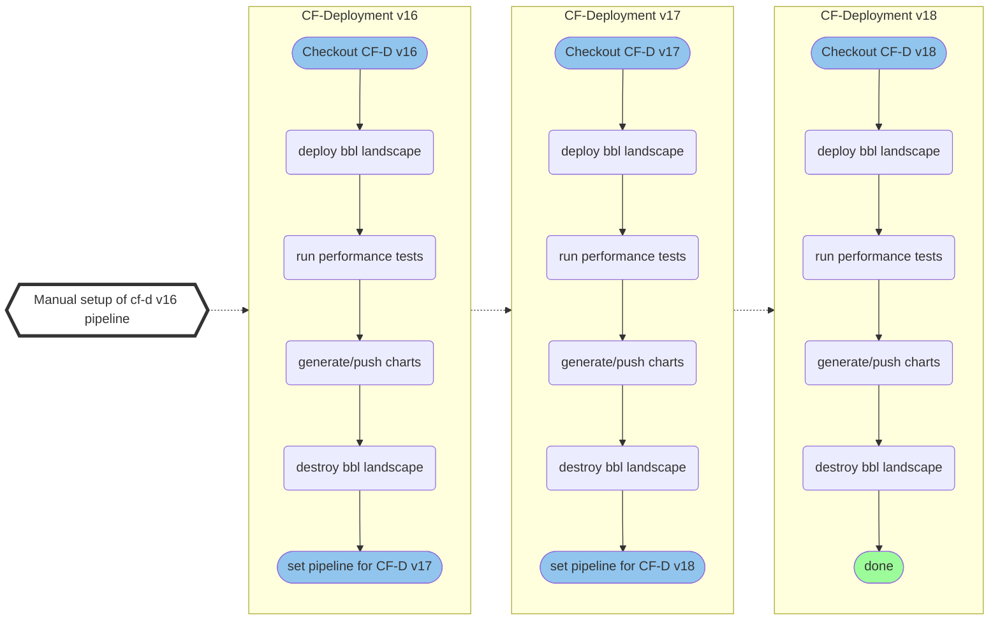

# Backfill Performance Tests Results For Older CF-Deployment Versions

In some cases, e.g. when adding new performance tests, it might be necessary to rerun all performance test against a list of CF-Deployment versions to ensure that results and charts are correctly backfilled.
For this purpose we implemented a dedicated performance test pipeline (`concourse/cf-perf-test-rerun.yml`) as part of [CFP-1926](https://jtrack.wdf.sap.corp/browse/CFP-1926).


## `cf-perf-test-backfill` Pipeline

The `cf-perf-test-backfill` pipeline runs the latest [cf-performance-tests](https://github.com/cloudfoundry/cf-performance-tests) against given CF-Deployment version(s). The pipeline is based upon `deploy-cf-perftest.yml` but skips some tasks like the cf acceptance tests. At the end the pipeline will set a new pipeline with the next CF-Deployment version which will be triggered automatically. The input for the CF-Deployment versions need to provided as variables files.

Example pipelines for CF-Deployment versions v16, v17, v18: 



As a result of this there will be a Concourse pipeline and git branch (for state tracking) for each CF-Deployment version when the backfill/rerun is completed. **All generated pipelines and git branches need to be deleted afterwards, see [cleanup section](#cleanup)**


### Inputs & Vars Files

For each CF-Deployment version there needs to be a vars file named `vX.X.X.yml` (e.g. `v16.12.0.yml`) located in `variables/cf-d-backfill`. The file has the following structure:
```YAML
cf-d:
  # Additonal ops files which are only need for specific versions (e.g. stemcells)
  additional-ops-files: ''

  # Trigger for generating new pipeline with target version.
  # Set to 'false' if there is no subsequent version
  has-follow-up: true

  # Current version to test
  source: v16.00.0

  # Next version to test
  target: v17.00.0
 
```
Those vars files can be generated with the `scripts/generate-cf-d-backfill-vars-files.py` python script which contains a list of CF-Deployment versions. The script requires Python 3 with PyYAML installed.

Furthermore, it might be useful to adjust some common vars like folders, branches etc. in `variables/vars-cf-perf-common.yml` to ensure that existing results are not overridden.

### Set & Trigger Initial Pipeline

#### Preparation
1) Verify & modify CF-Deployment versions in `scripts/generate-cf-d-backfill-vars-files.py`
2) Generate vars files with `python scripts/generate-cf-d-backfill-vars-files.py`
3) Adjust folders/branches in `variables/vars-cf-perf-common.yml`
4) Push changes to a new branch named after the first version, e.g. `v16.0.0`

#### Trigger pipeline
1) :warning: Pause [`deploy-cf-performance-test`](https://bosh.ci.cloudfoundry.org/teams/cf-controlplane/pipelines/deploy-cf-performance-test)
2) Set pipeline
```BASH
fly -t <target> set-pipeline \
  -p cf-perf-test-v<first-version> \
  --load-vars-from=variables/vars-cf-perf-common.yml \
  --load-vars-from=variables/cf-d-rerun/v<first-version>.yml \
  -c ./concourse/cf-perf-test-backfill.yml
```
3) Unpause pipeline in UI or with `fly`


### Cleanup
- Merge results and charts. Consider to clean up duplicates etc.
- Set pipeline:
  ```BASH
    fly -t bosh-cf pipelines --json | jq -M -r '.[].name |select( startswith("cf-perf-test"))' | xargs -n1 fly -t bosh-cf  dp -n -p
  ```
- After merging delete all git branches named `vX.X.X`