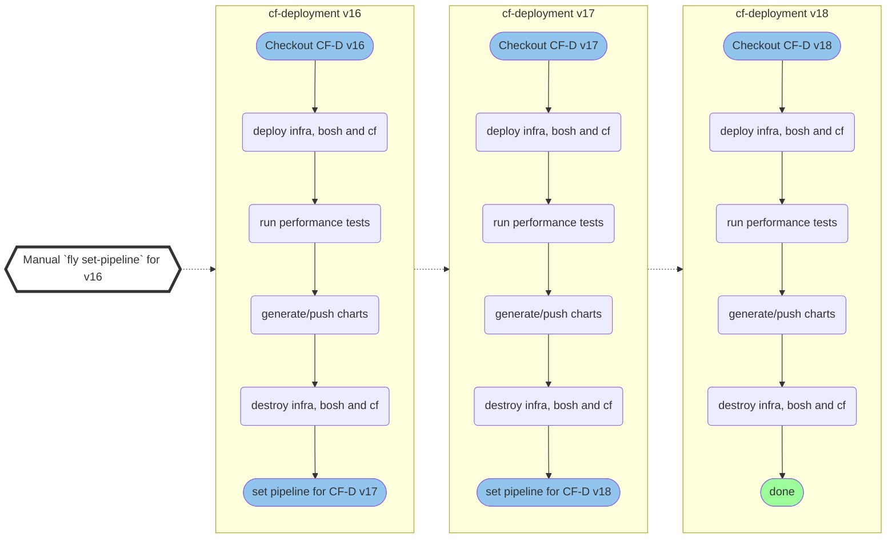

# Testing old versions

In some cases, such as when adding new performance test configurations, it might be desirable to rerun performance tests against a list of older releases of cf-deployment to fill in any gaps in our test result data. This uses a pipeline file generated by applying a patch to the regular `pipeline.yml` used to automatically test against new versions of cf-deployment.

1. Set the contents of the arrays `cf_deployment_releases` and `dbs` in [scripts/generate-backfill-vars-files.py](../scripts/generate-backfill-vars-files.py). 
1. Run the script with:
      ```bash
      python /Users/C5323189/Workspace/cf-performance-tests-pipeline/scripts/generate-cf-d-backfill-vars-files.py
      ```
1. Run the following to patch `pipeline.yml` to produce a `generated-backfill-pipeline.yml`:
      ```bash
      bosh interpolate --var-errs-unused ci/pipeline.yml --ops-file ci/backfill-patch.yml > ci/generated-backfill-pipeline.yml
      ```
1. Commit and push the newly-generated variables files, plus `generated-backfill-pipeline.yml` (if it has changed)
1. Manually set the pipeline for **the first test environment only** (each environment's pipeline will set the next pipeline after completing its tests):
      ```bash
      fly --target bosh-cf set-pipeline \
        --pipeline cf-perf-test-cfd-16-12-0 \
        --load-vars-from=variables/cf-d-backfill/cfd-16-12-0.yml \
        --load-vars-from variables/common.yml \
        --config ci/generated-backfill-pipeline.yml
      ```

## How it works

The backfill pipeline has been written so that upon completion it will set the pipeline for the 'next' test environment, which in turn will do the same for the next environment after that, and so on and so forth in a chain until the final test finishes.

Example pipelines for cf-deployment versions v16, v17, v18: 



A Concourse pipeline and git branch are created for each cf-deployment version, along with state in the shared `cf-performance-tests` S3 bucket. **These should be deleted afterwards, see [cleanup section](#cleanup)**


### Inputs & Vars Files

For each cf-deployment version there needs to be a vars file named `vX.X.X.yml` (e.g. `v16.12.0.yml`) located in `variables/cf-d-backfill`. The file has the following structure:
```YAML
cf-d:
  # Additonal ops files which are only need for specific versions (e.g. stemcells)
  additional-ops-files: ''

  # Trigger for generating new pipeline with target version.
  # Set to 'false' if there is no subsequent version
  has-follow-up: true

  # Current version to test
  source: v16.00.0

  # Next version to test
  target: v17.00.0
 
```
Those vars files can be generated with the `scripts/generate-backfill-vars-files.py` python script which contains a list of cf-deployment versions. The script requires Python 3 with PyYAML installed.

Furthermore, it might be useful to adjust some common vars like folders, branches etc. in `variables/vars-cf-perf-common.yml` to ensure that existing results are not overridden.

### Set & Trigger Initial Pipeline

#### Preparation
1) Verify & modify cf-deployment versions in `scripts/generate-backfill-vars-files.py`
2) Generate vars files with `python scripts/generate-backfill-vars-files.py`
3) Adjust folders/branches in `variables/vars-cf-perf-common.yml`
4) Push changes to a new branch named after the first version, e.g. `v16.0.0`

#### Trigger pipeline
1) :warning: Pause [`deploy-cf-performance-test`](https://bosh.ci.cloudfoundry.org/teams/cf-controlplane/pipelines/deploy-cf-performance-test)
2) Set pipeline
```bash
fly -t bosh-cf set-pipeline \
  -p cf-perf-test-v<first-version> \
  --load-vars-from=variables/vars-cf-perf-common.yml \
  --load-vars-from=variables/cf-d-rerun/v<first-version>.yml \
  -c ./concourse/cf-perf-test-backfill.yml
```
3) Unpause pipeline in UI or with `fly`


### Cleanup
Be certain that the last pipeline in the chain has finished its teardown successfully. [Manually clean up](./manual-setup.md#manual-destruction) any where automated teardown has failed.

- Delete pipelines:
  ```bash
    fly --target bosh-cf pipelines --json | jq -M -r '.[].name |select( startswith("perf-test-old"))' | xargs -n1 fly -t bosh-cf  destroy-pipeline --non-interactive --pipeline
  ```
- Delete branches:
  ```
    git --no-pager branch --remotes | awk -F/ '/\/perf-test-old/{print $2}' | xargs -I {} git push {} --delete
  ```
- S3:
  
